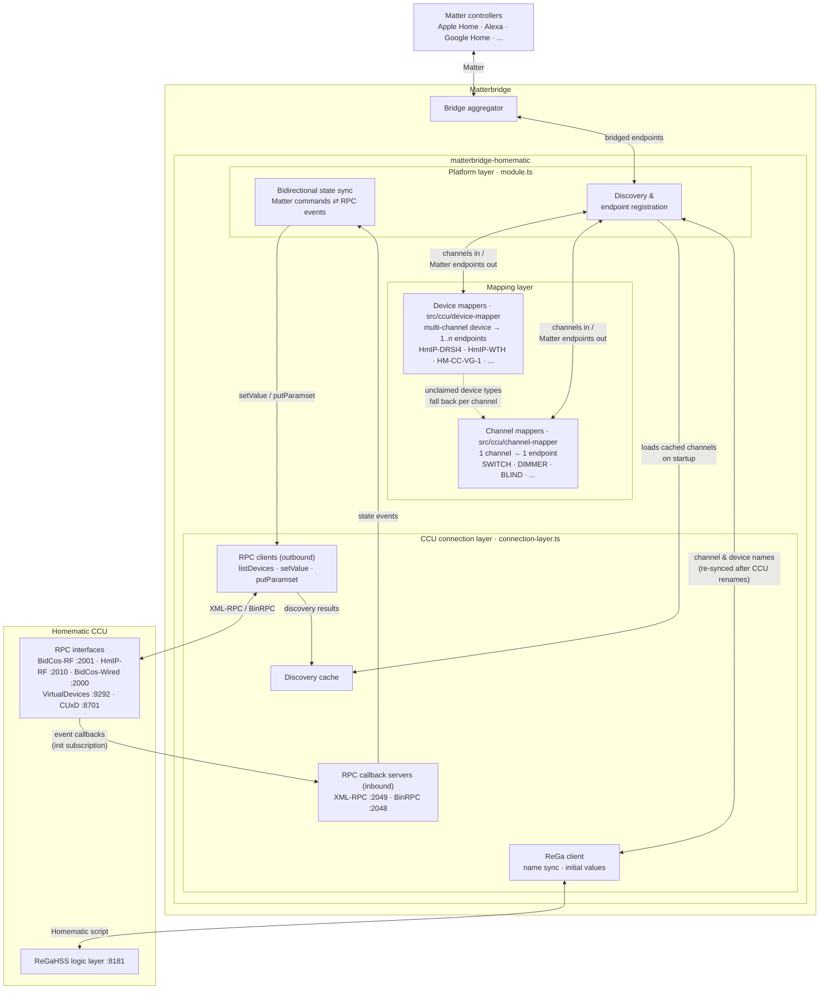

# &nbsp;&nbsp;&nbsp;Matterbridge Homematic Plugin

[](https://www.npmjs.com/package/matterbridge-homematic)
[](https://codecov.io/gh/hobbyquaker/matterbridge-homematic)

A [Matterbridge](https://github.com/Luligu/matterbridge) plugin for Homematic

This plugin bridges your Homematic CCU's devices to the Matter ecosystem

## Table of Contents

- [Installation](#installation)
- [Configuration](#configuration)
  - [RPC Server Configuration](#rpc-server-configuration)
  - [Channel Configuration UI](#channel-configuration-ui)
- [Troubleshooting](#troubleshooting)
- [Architecture](#architecture)
  - [Architecture Overview](#architecture-overview)
  - [Discovery Caching](#discovery-caching)
  - [Channel Mappers and Device Mappers](#channel-mappers-and-device-mappers)
- [Development](#development)
  - [Project Structure](#project-structure)
  - [Running Locally](#running-locally)
  - [Available Scripts](#available-scripts)
  - [Contributing](#contributing)
- [License](#license)
- [References](#references)
- [Support](#support)

## Installation

1. Install Matterbridge and this plugin via npm or the Matterbridge frontend
2. Configure your CCU host address and connection settings
3. Enable desired RPC interfaces (BidCos-RF, BidCos-Wired, HmIP-RF, etc.)
4. Restart Bridge
5. Open the Matterbridge frontend, click the plugin, and use the built-in channel configuration UI

## Configuration

### Basic Setup

### RPC Server Configuration

This plugin creates RPC callback servers to receive real-time device updates from the CCU. Understanding how to configure the ports is essential, especially in networked or containerized environments.

#### How It Works

The communication with the Homematic CCU involves **two independent communication directions**:

1. **Plugin → CCU** (Outbound): Plugin connects to CCU's RPC interface listeners
   - BidCos-RF: port 2001 (or 42001 with TLS)
   - BidCos-Wired: port 2000 (or 42000 with TLS)
   - HmIP-RF: port 2010 (or 42010 with TLS)
   - VirtualDevices: port 9292 (or 49292 with TLS)
   - CUxD: binary RPC port 8701

2. **CCU → Plugin** (Inbound): CCU connects to plugin's callback listeners via RPC
   - XML-RPC callback listener: `rpcXmlPort` (default: 2049)
   - Binary RPC callback listener: `rpcBinPort` (default: 2048)

#### Port Configuration

- **`rpcXmlPort`** - Port for XML-RPC callbacks (default: 2049)
- **`rpcBinPort`** - Port for Binary RPC callbacks (default: 2048)
- **`rpcServerHost`** - Interface to bind callback servers to (default: `0.0.0.0`)
- **`rpcInitAddress`** - IP/hostname (without port) the CCU uses to reach the plugin; the callback ports above are appended automatically (auto-detected or manually set)

#### NAT and Docker Configuration

If Matterbridge runs behind NAT, in Docker, or in a virtualized environment:

1. **Expose the RPC ports** in your Docker configuration:

   ```bash
   docker run -p 2048:2048 -p 2049:2049 ...
   ```

2. **Set the Init Address** to the external IP/hostname where CCU can reach the plugin:

   ```json
   {
     "rpcInitAddress": "192.168.1.200"
   }
   ```

3. **Configure firewall rules** to allow CCU to initiate connections to these ports

#### Multi-CCU Setup

If connecting multiple CCU instances, you must assign different RPC ports for each:

```json
{
  "rpcXmlPort": 2049,
  "rpcBinPort": 2048
}
```

For the second CCU:

```json
{
  "rpcXmlPort": 2059,
  "rpcBinPort": 2058
}
```

### Channel Configuration UI

The plugin ships a built-in configuration UI accessible directly from the Matterbridge frontend. Click the plugin entry to open it. From there you can:

- Enable/disable individual channels
- Choose the Matter device type for SWITCH channels (Light, Outlet, Switch, or Fan)
- Enable/disable humidity exposure for WTH/STHD thermostats
- View discovered device names, addresses, and registration status

Configuration changes that affect only channel-mapper channels (e.g. SWITCH, BLIND, SHUTTER_CONTACT) are applied live without a restart. Changes to device-mapper channels (e.g. WTH thermostats) require a plugin restart.

## Troubleshooting

### "Cannot connect to CCU" error

- Verify the CCU host address and that it's reachable from the Matterbridge machine
- Check if the required RPC interfaces are enabled on the CCU
- Ensure authentication credentials (if required) are correct

### Devices not appearing

- Open the channel configuration UI in the Matterbridge frontend to verify devices are discovered
- Check that channels are enabled
- Verify the device type is supported by the plugin
- Check Matterbridge logs for RPC discovery errors

### Device state not updating

- Verify RPC callback ports are accessible from the CCU
- In NAT/Docker environments, check that `rpcInitAddress` is correctly set
- Check firewall rules allow CCU to reach the callback ports
- Inspect Matterbridge logs for RPC callback errors

### Multiple CCU Setup Issues

- Ensure each CCU has unique `rpcXmlPort` and `rpcBinPort` values
- Verify all ports are exposed/forwarded if behind NAT
- Check that each CCU's `rpcInitAddress` points to the correct external address

## Architecture

### Architecture Overview



**Name syncing:** channel and device names are fetched from the CCU's ReGaHSS logic layer and used as the display names of the Matter endpoints. When a device is renamed on the CCU, the plugin picks up the new name on the next sync; the enable/disable selection remains stable because it is keyed by interface, channel type, and serial — not by name.

### Discovery Caching

To minimize startup time, the plugin caches discovered devices:

- **Cache File**: `~/.matterbridge/matterbridge-homematic-discovery.cache.json`
- **Behavior**: Returns cached data immediately on startup
- **Background Refresh**: Updates cache asynchronously from live RPC/ReGa data
- **Persistence**: Survives plugin restarts and Matterbridge updates

### Channel Mappers and Device Mappers

The plugin uses a two-tier mapping system to translate Homematic channels into Matter endpoints.

**Channel mappers** (`src/ccu/channel-mapper/`) handle the common case: a single Homematic channel becomes a single Matter endpoint. Each mapper is keyed by the Homematic channel type string (e.g. `SWITCH`, `BLIND`, `HEATING_CLIMATECONTROL_TRANSCEIVER`). When the channel type is found in the registry, the corresponding mapper function creates the right `MatterbridgeEndpoint` with the correct device type and cluster servers.

**Device mappers** (`src/ccu/device-mapper/`) handle multi-channel devices where a physical device must be split into more than one Matter endpoint, or where channels need to be combined. A device mapper receives all channels for a physical Homematic device and returns zero or more endpoints. Device mappers take priority over channel mappers for the device types they cover.

**Example:** The HmIP-DRSI4 has four independent relay outputs. Its device mapper pairs each `SWITCH_TRANSMITTER` with the first `SWITCH_VIRTUAL_RECEIVER` that follows it, returning four separate Matter on/off endpoints — one per relay output. Without a device mapper the generic channel loop would create endpoints for every individual channel instead.

For a detailed architecture reference, conventions, and a guide to writing new mappers, see [mapper.instructions.md](.github/instructions/homematic/mapper.instructions.md).

## Development

### Project Structure

```text
src/
├── module.ts                        # Main plugin entry & platform class
└── ccu/
    ├── connection-layer.ts          # RPC/ReGa communication & callbacks
    ├── device-mapper.ts             # Device mapper dispatcher
    ├── device-power.ts              # Battery/power classification
    ├── mapper-utils.ts              # Shared endpoint builder helpers
    ├── config.ts                    # Configuration parsing
    ├── types.ts                     # TypeScript interfaces
    ├── channel-mapper/              # Per channel-type mapper functions
    │   ├── switch.ts, blind.ts, dimmer.ts, ...
    │   └── index.ts                 # Channel mapper registry
    └── device-mapper/               # Per device-type mapper functions
        ├── hmip-drsi4.ts, hmip-wth.ts, ...
        └── index.ts                 # Device mapper registry
vitest/                              # Vitest unit tests
test/                                # Jest integration tests
```

### Running Locally

```bash
npm install
npm run build
npm run test
npm run lint
```

### Available Scripts

- `npm run build` - TypeScript compilation
- `npm run watch` - Continuous compilation
- `npm run test` - Run Jest tests with coverage
- `npm run lint` - ESLint and Prettier checks
- `npm run format` - Auto-format code
- `npm run start` - Start Matterbridge with plugin (dev)

### Contributing

Contributions are welcome! Please:

1. Fork the repository
2. Create a feature branch
3. Follow the code style (ESLint/Prettier enforced)
4. Add/update tests for changes
5. Submit a pull request

## License

Apache License 2.0 - See [LICENSE](LICENSE) for details.

## References

- [Matterbridge](https://github.com/Luligu/matterbridge) - Matter protocol bridge framework
- [node-red-contrib-ccu](https://github.com/rdmtc/node-red-contrib-ccu) - Reference for CCU RPC communication patterns
- [Homematic](https://github.com/hobbyquaker/awesome-homematic) - Awesome Homematic resources

## Support

If you find this plugin useful, please consider:

- Giving it a ⭐ on [GitHub](https://github.com/hobbyquaker/matterbridge-homematic)
- Contributing improvements and bug fixes
- Sponsoring the development
